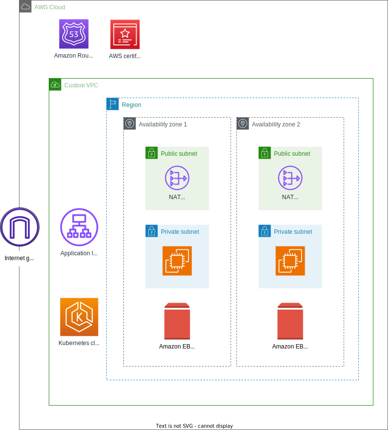

# CloudBees CI blueprint add-on: Get started

Get started with the [CloudBees CI on modern platforms in Amazon Elastic Kubernetes Service (Amazon EKS)](https://docs.cloudbees.com/docs/cloudbees-ci/latest/eks-install-guide/) by running this blueprint, which only installs the product and its [prerequisites](https://docs.cloudbees.com/docs/cloudbees-ci/latest/eks-install-guide/installing-eks-using-helm#_prerequisites), to help you understand the minimum setup:

- Amazon Web Services (AWS) certificate manager
- The following [Amazon EKS blueprints add-ons](https://aws-ia.github.io/terraform-aws-eks-blueprints-addons/main/):
  - [AWS Load Balancer Controller](https://aws-ia.github.io/terraform-aws-eks-blueprints-addons/main/addons/aws-load-balancer-controller/)
  - [ExternalDNS](https://aws-ia.github.io/terraform-aws-eks-blueprints-addons/main/addons/external-dns/)
  - [Amazon Elastic Block Store (Amazon EBS) Container Storage Interface (CSI) driver](https://docs.aws.amazon.com/eks/latest/userguide/ebs-csi.html), to allocate Amazon EBS volumes for hosting [$JENKINS_HOME](https://docs.cloudbees.com/docs/cloudbees-ci/latest/backup-restore/jenkins-home).

> [!TIP]
> A [resource group](https://docs.aws.amazon.com/ARG/latest/userguide/resource-groups.html) is added, to get a full list with all resources created by this blueprint.

## Architecture



This blueprint presents the minimum setup to run CloudBees CI on Amazon EKS; one node group for all Kubernetes workloads.
  - Instance type: [Graviton Processor](https://aws.amazon.com/ec2/graviton/) family.
  - Amazon Machine Image (AMI) type: [Amazon EKS-Optimized Amazon Linux 2023](https://aws.amazon.com/blogs/containers/amazon-eks-optimized-amazon-linux-2023-amis-now-available/)

### Workloads


## Terraform documentation

<!-- BEGIN_TF_DOCS -->
### Inputs

| Name | Description | Type | Default | Required |
|------|-------------|------|---------|:--------:|
| hosted_zone | Amazon Route 53 hosted zone. CloudBees CI applications are configured to use subdomains in this hosted zone. | `string` | n/a | yes |
| trial_license | CloudBees CI trial license details for evaluation. | `map(string)` | n/a | yes |
| aws_region | AWS region to deploy resources to. It requires at minimun 2 AZs. | `string` | `"us-west-2"` | no |
| ci | Running in a CI service versus running locally. False when running locally, true when running in a CI service. | `bool` | `false` | no |
| suffix | Unique suffix to assign to all resources. | `string` | `""` | no |
| tags | Tags to apply to resources. | `map(string)` | `{}` | no |

### Outputs

| Name | Description |
|------|-------------|
| acm_certificate_arn | AWS Certificate Manager (ACM) certificate for Amazon Resource Names (ARN). |
| cbci_helm | Helm configuration for the CloudBees CI add-on. It is accessible via state files only. |
| cbci_initial_admin_password | Operations center service initial admin password for the CloudBees CI add-on. |
| cbci_liveness_probe_ext | Operations center service external liveness probe for the CloudBees CI add-on. |
| cbci_liveness_probe_int | Operations center service internal liveness probe for the CloudBees CI add-on. |
| cbci_namespace | Namespace for the CloudBees CI add-on. |
| cbci_oc_ing | Operations center Ingress for the CloudBees CI add-on. |
| cbci_oc_pod | Operations center pod for the CloudBees CI add-on. |
| cbci_oc_url | URL of the CloudBees CI operations center for the CloudBees CI add-on. |
| eks_cluster_arn | Amazon EKS cluster ARN. |
| eks_cluster_name | Amazon EKS cluster Name. |
| kubeconfig_add | Adds kubeconfig to your local configuration to access the Kubernetes API. |
| kubeconfig_export | Exports the KUBECONFIG environment variable to access the Kubernetes API. |
| vpc_arn | VPC ID. |
<!-- END_TF_DOCS -->

## Deploy

When preparing to deploy, you must complete the following steps:

1. Customize your Terraform values by copying `.auto.tfvars.example` to `.auto.tfvars`.
1. Initialize the root module and any associated configuration for providers.
1. Create the resources and deploy CloudBees CI to an EKS cluster. Refer to [Amazon EKS Blueprints for Terraform - Deploy](https://aws-ia.github.io/terraform-aws-eks-blueprints/getting-started/#deploy).

For more information, refer to [The Core Terraform Workflow](https://www.terraform.io/intro/core-workflow) documentation.

> [!TIP]
> The `deploy` phase can be orchestrated via the companion [Makefile](../Makefile).

## Validate

Once the blueprint has been deployed, you can validate it.

### Kubeconfig

Once the resources have been created, a `kubeconfig` file is created in the [/k8s](k8s) folder. Issue the following command to define the [KUBECONFIG](https://kubernetes.io/docs/concepts/configuration/organize-cluster-access-kubeconfig/#the-kubeconfig-environment-variable) environment variable to point to the newly generated file:

```sh
  eval $(terraform output --raw kubeconfig_export)
```

If the command is successful, no output is returned.

### CloudBees CI

Once you can access the Kubernetes API from your terminal, complete the following steps.

1. Issue the following command to verify that the CloudBees CI operations center pod is in a `Running` state:

    ```sh
    eval $(terraform output --raw cbci_oc_pod)
    ```

1. Issue the following command to verify that the Ingress is ready and has assigned a valid `ADDRESS`:

    ```sh
    eval $(terraform output --raw cbci_oc_ing)
    ```

1. Issue the following command to verify that the operations center service is running from inside the Kubernetes cluster:

    ```sh
    eval $(terraform output --raw cbci_liveness_probe_int)
    ```

    If the command is successful, no output is returned.

1. Issue the following command to verify that the operations center service is running from outside the Kubernetes cluster:

    ```sh
    eval $(terraform output --raw cbci_liveness_probe_ext)
    ```

    If the command is successful, no output is returned.

1. DNS propagation may take several minutes. Once propagation is complete, issue the following command, copy the output, and then paste it into a web browser.

    ```sh
    terraform output cbci_oc_url
    ```

1. Paste the output of the previous command into your browser to access the CloudBees CI setup wizard to complete the CloudBees CI operations center installation.

1. Issue the following command to retrieve the first administrative user password (required):

    ```sh
    eval $(terraform output --raw cbci_initial_admin_password)
    ```

## Destroy

To tear down and remove the resources created in the blueprint, complete the steps for [Amazon EKS Blueprints for Terraform - Destroy](https://aws-ia.github.io/terraform-aws-eks-blueprints/getting-started/#destroy).

> [!TIP]
> The `destroy` phase can be orchestrated via the companion [Makefile](../Makefile).
