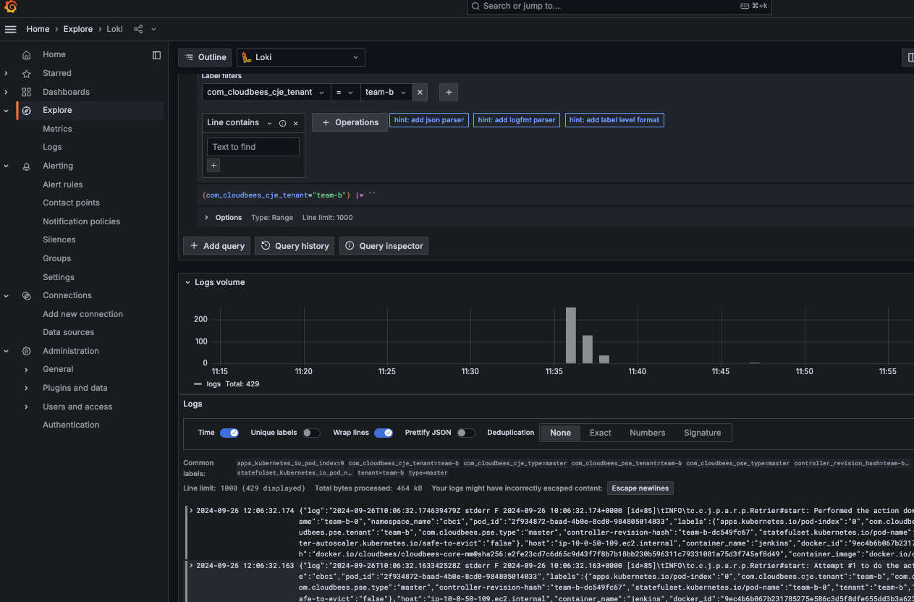

# CloudBees CI blueprint add-on: At scale

Once you have familiarized yourself with [CloudBees CI blueprint add-on: Get started](../01-getting-started/README.md), this blueprint presents a scalable architecture and configuration by adding:

- An [Amazon Elastic File System (Amazon EFS) drive](https://aws.amazon.com/efs/) that is required by CloudBees CI High Availability/Horizontal Scalability (HA/HS) controllers and is optional for non-HA/HS controllers.
- An [Amazon Simple Storage Service (Amazon S3) bucket](https://aws.amazon.com/s3/) to store assets from applications like CloudBees CI, Velero, and Fluent Bit.
- [Amazon Elastic Kubernetes Service (Amazon EKS) managed node groups](https://docs.aws.amazon.com/eks/latest/userguide/managed-node-groups.html) for different workloads: shared services, CI applications, CI Linux on-demand agents, CI Linux spot agents, and CI Microsoft Windows on-demand agents.
- [Amazon CloudWatch Logs](https://docs.aws.amazon.com/AmazonCloudWatch/latest/logs/WhatIsCloudWatchLogs.html) to explode control plane logs and Fluent Bit logs.
- The following [Amazon EKS blueprints add-ons](https://aws-ia.github.io/terraform-aws-eks-blueprints-addons/main/):

  | Amazon EKS blueprints add-ons | Description |
  |-------------------------------|-------------|
  | [AWS EFS CSI Driver](https://aws-ia.github.io/terraform-aws-eks-blueprints-addons/main/addons/aws-efs-csi-driver/)| Connects the Amazon Elastic File System (Amazon EFS) drive to the Amazon EKS cluster. |
  | [AWS for Fluent Bit](https://aws-ia.github.io/terraform-aws-eks-blueprints-addons/main/addons/aws-for-fluentbit/)| Acts as an applications log router for log observability in CloudWatch. |
  | [Cluster Autoscaler](https://aws-ia.github.io/terraform-aws-eks-blueprints-addons/main/addons/cluster-autoscaler/) | Watches Amazon EKS managed node groups to accomplish [CloudBees CI auto-scaling nodes on EKS](https://docs.cloudbees.com/docs/cloudbees-ci/latest/cloud-admin-guide/eks-auto-scaling-nodes). |
  | [Kube Prometheus Stack](https://aws-ia.github.io/terraform-aws-eks-blueprints-addons/main/addons/kube-prometheus-stack/) | Observability backbone.|
  | [Metrics Server](https://aws-ia.github.io/terraform-aws-eks-blueprints-addons/main/addons/metrics-server/) | This is a requirement for CloudBees CI HA/HS controllers for horizontal pod autoscaling.|
  | [Velero](https://aws-ia.github.io/terraform-aws-eks-blueprints-addons/main/addons/velero/)| Backs up and restores Kubernetes resources and volume snapshots. It is only compatible with Amazon Elastic Block Store (Amazon EBS).|
  | [Bottlerocket Update Operator](https://aws-ia.github.io/terraform-aws-eks-blueprints-addons/main/addons/bottlerocket/) | Coordinates Bottlerocket updates on hosts in a cluster. It is configured for CloudBees CI Applications and Agents Node Groups at a specific time according to `scheduler_cron_expression`, when the build workload is minimal (weekend). In a case where the CI service cannot be interrupted at any time by the Update Operator, it could be excluded from planned updates by removing the [bottlerocket.aws/updater-interface-version=2.0.0](https://github.com/bottlerocket-os/bottlerocket-update-operator#label-nodes) label. [Cert-manager](https://aws-ia.github.io/terraform-aws-eks-blueprints-addons/main/addons/cert-manager/) is required for the API server to use a CA certificate when communicating over SSL with the agents. |

- [Amazon EKS blueprints Helm Release Add-on](https://aws-ia.github.io/terraform-aws-eks-blueprints-addons/main/helm-release/) is used to install the following applications:

  | Helm Chart | Description |
  |-------------------------------|-------------|
  | [Helm Openldap](https://github.com/jp-gouin/helm-openldap/tree/master) | LDAP server for Kubernetes. |
  | [AWS Node Termination Handler](https://github.com/aws/aws-node-termination-handler) | Gracefully handles EC2 instance shutdown within Kubernetes. Note that this add-on is not compatible with managed instance groups. For more information, refer to [issue #23](https://github.com/cloudbees/terraform-aws-cloudbees-ci-eks-addon/issues/23). |
  | [Hashicorp Vault](https://github.com/hashicorp/vault-helm) | Secrets management system that is integrated via [CloudBees HashiCorp Vault Plugin](https://docs.cloudbees.com/docs/cloudbees-ci/latest/cloud-secure-guide/hashicorp-vault-plugin). |
  | [OTEL collector](https://grafana.com/oss/tempo/) | The collector for [Jenkins OpenTelemetry](https://plugins.jenkins.io/opentelemetry/) observability data. |
  | [Jagger](https://www.jaegertracing.io/) | Provides tracing backend for [Jenkins OpenTelemetry](https://plugins.jenkins.io/opentelemetry/). |
  | [Grafana Loki](https://grafana.com/oss/loki/) | Provides logs backend for [Jenkins OpenTelemetry](https://plugins.jenkins.io/opentelemetry/). |

- Cloudbees CI uses [Configuration as Code (CasC)](https://docs.cloudbees.com/docs/cloudbees-ci/latest/casc-oc/casc-intro) (refer to the [casc](cbci/casc) folder) to enable [exciting new features for streamlined DevOps](https://www.cloudbees.com/blog/cloudbees-ci-exciting-new-features-for-streamlined-devops) and other enterprise features, such as [CloudBees CI hibernation](https://docs.cloudbees.com/docs/cloudbees-ci/latest/cloud-admin-guide/managing-controllers#hibernation-managed-controllers).
  - The operations center is using the [CasC Bundle Retriever](https://docs.cloudbees.com/docs/cloudbees-ci/latest/casc-oc/bundle-retrieval-scm).
  - Managed controller configurations are managed from the operations center using [source control management (SCM)](https://docs.cloudbees.com/docs/cloudbees-ci/latest/casc-controller/add-bundle#_adding_casc_bundles_from_an_scm_tool).
  - The managed controllers are using [CasC bundle inheritance](https://docs.cloudbees.com/docs/cloudbees-ci/latest/casc-controller/advanced#_configuring_bundle_inheritance_with_casc) (refer to the [parent](cbci/casc/mc/parent) folder). This "parent" bundle is inherited by two types of "child" controller bundles: `ha` and `none-ha`, to accommodate [considerations about HA controllers](https://docs.cloudbees.com/docs/cloudbees-ci/latest/ha/ha-considerations).

> [!TIP]
> A [resource group](https://docs.aws.amazon.com/ARG/latest/userguide/resource-groups.html) is also included, to get a full list of all resources created by this blueprint.

## Architecture

This blueprint divides scalable node groups for different types of workloads:

- Shared node group services (role: `shared`): For common/shared workloads using [Amazon EKS-Optimized Amazon Linux 2023](https://aws.amazon.com/blogs/containers/amazon-eks-optimized-amazon-linux-2023-amis-now-available/) Amazon Machine Image (AMI) type.
- CloudBees CI node groups:
  - CI services (role: `cb-apps`):
    - Services instance type: [AWS Graviton Processor](https://aws.amazon.com/ec2/graviton/) and [Bottlerocket OS](https://aws.amazon.com/bottlerocket/) AMI type.
    - It uses an [instance profile](https://docs.aws.amazon.com/IAM/latest/UserGuide/id_roles_use_switch-role-ec2_instance-profiles.html) for operating with AWS services permissions (for example, S3 buckets). However, the recommended options are explained in [Issue 56](https://github.com/cloudbees/terraform-aws-cloudbees-ci-eks-addon/issues/56).
  - CI agents (ephemeral):
    - Linux: [AWS Graviton Processor](https://aws.amazon.com/ec2/graviton/) and [Bottlerocket OS](https://aws.amazon.com/bottlerocket/) AMI type and includes on-demand (role: `build-linux`) and Spot (role: `build-linux-spot`) capacity types. The Spot agent node groups follow the principles described in [Building for Cost Optimization and Resilience for EKS with Spot Instances](https://aws.amazon.com/blogs/compute/cost-optimization-and-resilience-eks-with-spot-instances/).
    - Windows (role: `build-windows`): Windows 2019 AMI type.

> [!IMPORTANT]
> The launch time for Linux containers is faster than Windows containers. This can be improved by using a cache container image strategy. Refer to [Speeding up Windows container launch times with EC2 Image builder and image cache strategy](https://aws.amazon.com/blogs/containers/speeding-up-windows-container-launch-times-with-ec2-image-builder-and-image-cache-strategy/) and more about [Windows Container Best Practices](https://aws.github.io/aws-eks-best-practices/windows/docs/ami/)). Another potential alternative is to use Windows VMs with a [shared agent](https://docs.cloudbees.com/docs/cloudbees-ci/latest/cloud-admin-guide/shared-agents).


### Workloads


## Terraform Docs

<!-- BEGIN_TF_DOCS -->
### Inputs

| Name | Description | Type | Default | Required |
|------|-------------|------|---------|:--------:|
| hosted_zone | Amazon Route 53 hosted zone. CloudBees CI applications are configured to use subdomains in this hosted zone. | `string` | n/a | yes |
| trial_license | CloudBees CI trial license details for evaluation. | `map(string)` | n/a | yes |
| aws_region | AWS region to deploy resources to. It requires at minimun 3 AZs. | `string` | `"us-west-2"` | no |
| ci | Running in a CI service versus running locally. False when running locally, true when running in a CI service. | `bool` | `false` | no |
| dh_reg_secret_auth | Docker Hub Registry server authentication details for cbci-sec-reg secret. | `map(string)` | <pre>{<br>  "email": "foo.bar@acme.com",<br>  "password": "changeme1234",<br>  "username": "foo"<br>}</pre> | no |
| suffix | Unique suffix to assign to all resources. When adding the suffix, changes are required in CloudBees CI for the validation phase. | `string` | `""` | no |
| tags | Tags to apply to resources. | `map(string)` | `{}` | no |

### Outputs

| Name | Description |
|------|-------------|
| acm_certificate_arn | AWS Certificate Manager (ACM) certificate for Amazon Resource Names (ARN). |
| aws_backup_efs_protected_resource | AWS description for the Amazon EFS drive that is used to back up protected resources. |
| aws_logstreams_fluentbit | AWS CloudWatch log streams from Fluent Bit. |
| cbci_agent_linuxtempl_events | Retrieves a list of events related to Linux template agents. |
| cbci_agent_sec_reg | Retrieves the container registry secret deployed in the agents namespace. |
| cbci_agent_windowstempl_events | Retrieves a list of events related to Windows template agents. |
| cbci_agents_pods | Retrieves a list of agent pods running in the agents namespace. |
| cbci_controller_b_s3_build | team-b hibernation monitor endpoint to the build s3-WScacheAndArtifacts. It expects CBCI_ADMIN_TOKEN as the environment variable. |
| cbci_controller_c_hpa | team-c horizontal pod autoscaling. |
| cbci_controller_c_windows_node_build | team-c hibernation monitor endpoint to the Windows build nodes. It expects CBCI_ADMIN_TOKEN as the environment variable. |
| cbci_controllers_pods | Operations center pod for the CloudBees CI add-on. |
| cbci_helm | Helm configuration for the CloudBees CI add-on. It is accessible via state files only. |
| cbci_liveness_probe_ext | Operations center service external liveness probe for the CloudBees CI add-on. |
| cbci_liveness_probe_int | Operations center service internal liveness probe for the CloudBees CI add-on. |
| cbci_namespace | Namespace for the CloudBees CI add-on. |
| cbci_oc_export_admin_api_token | Exports the operations center cbci_admin_user API token to access the REST API when CSRF is enabled. It expects CBCI_ADMIN_CRUMB as the environment variable. |
| cbci_oc_export_admin_crumb | Exports the operations center cbci_admin_user crumb, to access the REST API when CSRF is enabled. |
| cbci_oc_ing | Operations center Ingress for the CloudBees CI add-on. |
| cbci_oc_pod | Operations center pod for the CloudBees CI add-on. |
| cbci_oc_take_backups | Operations center cluster operations build for the on-demand back up. It expects CBCI_ADMIN_TOKEN as the environment variable. |
| cbci_oc_url | Operations center URL for the CloudBees CI add-on. |
| efs_access_points | Amazon EFS access points. |
| efs_arn | Amazon EFS ARN. |
| eks_cluster_arn | Amazon EKS cluster ARN. |
| eks_cluster_name | Amazon EKS cluster Name. |
| global_password | Random string that is used as the global password. |
| grafana_dashboard | Provides access to Grafana dashboards. |
| kubeconfig_add | Add kubeconfig to the local configuration to access the Kubernetes API. |
| kubeconfig_export | Export the KUBECONFIG environment variable to access the Kubernetes API. |
| prometheus_active_targets | Checks active Prometheus targets from the operations center. |
| prometheus_dashboard | Provides access to Prometheus dashboards. |
| s3_cbci_arn | CloudBees CI Amazon S3 bucket ARN. |
| s3_cbci_name | CloudBees CI Amazon S3 bucket name. It is required by CloudBees CI for workspace caching and artifact management. |
| s3_list_objects | Recursively lists all objects stored in the Amazon S3 bucket. |
| vault_configure | Configure Vault with initial secrets and creates approle for integration with CloudBees CI (role-id and secret-id). It requires unseal keys and the root token from the vault_init output. |
| vault_dashboard | Provides access to Hashicorp Vault dashboard. It requires the root token from the vault_init output. |
| vault_init | Inicialization of Vault Service. |
| vault_init_log_file | Vault Inicialization log file. |
| velero_backup_on_demand | Takes an on-demand Velero backup from the schedule for the selected controller that is using block storage. |
| velero_backup_schedule | Creates a Velero backup schedule for the selected controller that is using block storage, and then deletes the existing schedule, if it exists. |
| velero_restore | Restores the selected controller that is using block storage from a backup. |
| vpc_arn | VPC ID. |
<!-- END_TF_DOCS -->

## Prerequisites

This blueprint uses [DockerHub](https://hub.docker.com/) as a container registry service. Note that an existing DockerHub account is required (username, password, and email).

> [!TIP]
> Use `docker login` to validate username and password.

## Deploy

When preparing to deploy, you must complete the following steps:

1. Customize your Terraform values by copying `.auto.tfvars.example` to `.auto.tfvars`.
2. Initialize the root module and any associated configuration for providers.
3. Create the resources and deploy CloudBees CI to an EKS cluster. Refer to [Amazon EKS Blueprints for Terraform - Deploy](https://aws-ia.github.io/terraform-aws-eks-blueprints/getting-started/#deploy).

For more information, refer to [The Core Terraform Workflow](https://www.terraform.io/intro/core-workflow) documentation.

> [!TIP]
> The `deploy` phase can be orchestrated via the companion [Makefile](../../Makefile).

## Validate

Once the blueprint has been deployed, you can validate it.

### Kubeconfig

Once the resources have been created, a `kubeconfig` file is created in the [/k8s](k8s) folder. Issue the following command to define the [KUBECONFIG](https://kubernetes.io/docs/concepts/configuration/organize-cluster-access-kubeconfig/#the-kubeconfig-environment-variable) environment variable to point to the newly generated file:

   ```sh
   eval $(terraform output --raw kubeconfig_export)
   ```

   If the command is successful, no output is returned.

### CloudBees CI

1. Complete the steps to [validate CloudBees CI](../01-getting-started/README.md#cloudbees-ci), if you have not done so already.

2. Authentication in this blueprint is based on LDAP using the `cn` user (available in [k8s/openldap-stack-values.yml](./k8s/openldap-stack-values.yml)) and the global password. The authorization level defines a set of permissions configured using [RBAC](https://docs.cloudbees.com/docs/cloudbees-ci/latest/cloud-secure-guide/rbac). Additionally, the operations center and controller use [single sign-on (SS0)](https://docs.cloudbees.com/docs/cloudbees-ci/latest/cloud-secure-guide/using-sso), including a [fallback mechanism](https://docs.cloudbees.com/docs/cloudbees-ci-kb/latest/operations-center/how-ldap-plugin-works-on-cjoc-sso-context) that is enabled by default. Issue the following command to retrieve the global password (valid for all users):

   ```sh
   eval $(terraform output --raw global_password)
   ```

   There are differences in CloudBees CI permissions and folder restrictions when signed in as a user of the Admin group versus the Development group. For example, only Admin users have access to the agent validation jobs.

3. CasC is enabled for the [operations center](https://docs.cloudbees.com/docs/cloudbees-ci/latest/casc-oc/) (`cjoc`) and [controllers](https://docs.cloudbees.com/docs/cloudbees-ci/latest/casc-controller/) (`team-b` and `team-c-ha`). `team-a` is not using CasC, to illustrate the difference between the two approaches. Issue the following command to verify that all controllers are running:

   ```sh
   eval $(terraform output --raw cbci_controllers_pods)
   ```

   If successful, it should indicate that 2 replicas are running for `team-c-ha` since [CloudBees CI HA/HS](https://docs.cloudbees.com/docs/cloudbees-ci/latest/ha-install-guide/) is enabled on this controller.

4. Issue the following command to verify that horizontal pod autoscaling is enabled for `team-c-ha`:

   ```sh
   eval $(terraform output --raw cbci_controller_c_hpa)
   ```

#### Secrets management

##### Kubernetes secret

This blueprint Kubernetes secrets for different purposes.

> [!NOTE]
> - Beyond the CloudBees CI add-on (used for demo purposes), Kubernetes secrets can be managed via [External Secret Operators](https://aws-ia.github.io/terraform-aws-eks-blueprints-addons/main/addons/external-secrets/).
> - Kubernetes secrets could be also be retrived as Jenkins Credentials via using the [Kubernetes Credentials Provider plugin](https://jenkinsci.github.io/kubernetes-credentials-provider-plugin/).

###### CasC secrets

The secrets key/value file defined in [k8s/secrets-values.yml](k8s/secrets-values.yml) is converted into a Kubernetes secret (`cbci-sec-casc`) and mounted into `/run/secrets/` for the operations center and controllers to be consumed via CloudBees CasC. Refer to [Configuration as Code - Handling Secrets - Kubernetes Secrets](https://github.com/jenkinsci/configuration-as-code-plugin/blob/master/docs/features/secrets.adoc#kubernetes-secrets) for more information.

###### Container registry secrets

DockerHub authentication is stored as Kubernetes secrets (`cbci-agent-sec-reg`) and mounted to [Kaniko agent containers](https://docs.cloudbees.com/docs/cloudbees-ci/latest/cloud-admin-guide/using-kaniko) to build and push images to this registry. The secret is created using the `dh_reg_secret_auth` variable.

```sh
   eval $(terraform output --raw cbci_agent_sec_reg)
```

> [!NOTE]
> ECR authentication is done via instance profile connected to `build-linux-spot` Node pools.

##### HashiCorp Vault

HashiCorp Vault is used as a credential provider for CloudBees CI Pipelines in this blueprint.

1. Initialize Hashicorp Vault. Keep in a safe place Admin Token and Unseal Keys (saved in `k8s/vault-init.log`).

   ```sh
   eval $(terraform output --raw vault_init)
   ```

2. Run the configure Hashicorp Vault script. It configures Vault with initial secrets and creates `approle` for integration with CloudBees CI (role-id and secret-id)

   ```sh
   eval $(terraform output --raw vault_configure)
   ```

3. Access the HashiCorp Vault UI by issuing the following command. Enter the root token to log in from the _step 1_.

   ```sh
   eval $(terraform output --raw vault_dashboard)
   ```

   If successful, the Vault web service should be available at `http://localhost:50003` and you can view the secrets that were created in _step 2_.

4. Sign in to the CloudBees CI operations center as a user with the admin role.

5. Navigate to **Manage Jenkins > Credentials Providers > HashiCorp Vault Credentials Provider** and complete the configuration for the CloudBees CI Vault Plugin by entering the role ID and secret ID for the `cbci-oc` application role from _step 1_.

6. Select **Test Connection** to verify the inputs are correct.

7. Move to `team-b` or `team-c-ha` to run the Pipeline (**admin > validations > vault-credentials**) and validate that credentials are fetched correctly from the Hashicorp Vault.

> [!NOTE]
> Hashicorp Vault can be also be configured to be used for [Configuration as Code - Handling Secrets - Vault](https://github.com/jenkinsci/configuration-as-code-plugin/blob/master/docs/features/secrets.adoc#hashicorp-vault-secret-source).

#### Builds

##### Build Node Pools

1. For the following validations, builds will be triggered remotely. Start by issuing the following command to retrieve an [API token](https://docs.cloudbees.com/docs/cloudbees-ci-api/latest/api-authentication) for the `admin_cbci_a` user with the correct permissions for the required actions:

   ```sh
   eval $(terraform output --raw cbci_oc_export_admin_crumb) && \
   eval $(terraform output --raw cbci_oc_export_admin_api_token) && \
   printenv | grep CBCI_ADMIN_TOKEN
   ```

   If the command is not successful, issue the following command to validate that DNS propagation has been completed:

   ```sh
   eval $(terraform output --raw cbci_liveness_probe_ext)
   ```

2. Once you have retrieved the API token, issue the following commands to trigger builds using the [POST queue for hibernation API endpoint](https://docs.cloudbees.com/docs/cloudbees-ci/latest/cloud-admin-guide/managing-controllers#_post_queue_for_hibernation). If successful, an `HTTP/2 201` response is returned, indicating the REST API call has been correctly received by the CloudBees CI controller.

   - For Linux node pools use:

      ```sh
      eval $(terraform output --raw cbci_controller_b_s3_build)
      ```

      It triggers the `s3-WScacheAndArtifacts` Pipeline from the `team-b` controller. This pipeline validates S3 integrations in parallel for [CloudBees workspace caching](https://docs.cloudbees.com/docs/cloudbees-ci/latest/pipelines/cloudbees-cache-step) (using `linux-mavenAndKaniko-L`) and the [S3 artifact manager](https://plugins.jenkins.io/artifact-manager-s3/) (using `linux-mavenAndKaniko-XL`).

      Once the second build is complete, you can find the read cache operation at the beginning of the build logs and the write cache operation at the end of the build logs.

      The `linux-mavenAndKaniko-L` agent template is deployed over on-demand Linux nodes that have smaller instance types versus the `linux-mavenAndKaniko-XL` template that is deployed over Spot Linux nodes that have defined larger instance types.

   - For Windows node pool use:

      ```sh
      eval $(terraform output --raw cbci_controller_c_windows_node_build)
      ```

      It triggers the `windows-build-nodes` Pipeline from the `team-c-ha` controller.

      Note that the first build for a new Windows image container can take up to 10 minutes to run; subsequent builds should take seconds to run. This behavior can be improved, as explained in the section [Architecture](#architecture).

3. Right after triggering the builds, issue the following to validate pod agent provisioning to build the Pipeline code:

   ```sh
   eval $(terraform output --raw cbci_agents_pods)
   ```

4. Check build logs by signing in to the `team-b` and `team-c-ha` controllers, respectively. Navigate to the Pipeline jobs and select the first build, indicated by the `#1` build number. [CloudBees Pipeline Explorer](https://docs.cloudbees.com/docs/cloudbees-ci/latest/pipelines/cloudbees-pipeline-explorer-plugin) is enabled by default.

##### Container Registry

This blueprints use a couple of container registries for different purposes.

- The public registry uses DockerHub.
- The private registry uses AWS ECR.

> [!NOTE]
> Other Container Registry services can be used for the same purposes.

Sign in to the CloudBees CI to `team-b` or `team-c-ha` controllers with admin access. Run the **admin > validations > kaniko** Pipeline and enter (using parameters) an existing DockerHub organization and an existing AWS ECR Repository to test that building and pushing to all repositories works as expected.

> [!NOTE]
> Besides Kaniko, there are [other alternitives tools](https://docs.cloudbees.com/docs/cloudbees-ci/latest/cloud-admin-guide/using-kaniko#_alternatives).

#### Back up and restore

For backup and restore operations, you can use the [preconfigured CloudBees CI Cluster Operations job](#create-daily-backups-using-a-cloudbees-ci-cluster-operations-job) to automatically perform a daily backup, which can be used for Amazon EFS and Amazon EBS storage.

[Velero](#create-a-velero-backup-schedule) is an alternative for services only for controllers using Amazon EBS. Velero commands and configuration in this blueprint follow [Using Velero back up and restore Kubernetes cluster resources](https://docs.cloudbees.com/docs/cloudbees-ci/latest/backup-restore/velero-dr).

> [!NOTE]
> - An installation that has been completely converted to CasC may not need traditional backups; a restore operation could consist simply of running a CasC bootstrap script. This is only an option for a customer who has translated every significant system setting and job configuration to CasC. Even then it may be desirable to perform a filesystem-level restore from backup in order to preserve transient data such as build history.
> - There is no alternative for services using Amazon EFS storage. Although [AWS Backup](https://aws.amazon.com/backup/) includes this Amazon EFS drive as a protected resource, there is not currently a best practice to dynamically restore Amazon EFS PVCs. For more information, refer to [Issue 39](https://github.com/cloudbees/terraform-aws-cloudbees-ci-eks-addon/issues/39).

##### Create daily backups using a CloudBees CI Cluster Operations job

The [CloudBees Backup plugin](https://docs.cloudbees.com/docs/cloudbees-ci/latest/backup-restore/cloudbees-backup-plugin) is enabled for all controllers and the operations center using [Amazon S3 as storage](https://docs.cloudbees.com/docs/cloudbees-ci/latest/backup-restore/cloudbees-backup-plugin#_amazon_s3). The preconfigured **backup-all-controllers** [Cluster Operations](https://docs.cloudbees.com/docs/cloudbees-ci/latest/cloud-admin-guide/cluster-operations) job is scheduled to run daily from the operations center to back up all controllers.

To view the **backup-all-controllers** job:

1. Sign in to the CloudBees CI operations center UI as a user with **Administer** privileges. Note that access to back up jobs is restricted to admin users via RBAC.
2. From the operations center dashboard, select **All** to view all folders on the operations center.
3. Navigate to the **admin** folder, and then select the **backup-all-controllers** Cluster Operations job.

Restore operations can be done on-demand at the controller level from the preconfigured restore job.

##### Create a Velero backup schedule

Issue the following command to create a Velero backup schedule for selected controller `team-b` (this can also be applied to `team-a`):

   ```sh
   eval $(terraform output --raw velero_backup_schedule)
   ```

##### Take an on-demand Velero backup

>[!NOTE]
> When using this CloudBees CI add-on, you must [create at least one Velero backup schedule](#create-a-velero-backup-schedule) prior to taking an on-demand Velero backup.

Issue the following command to take an on-demand Velero backup for a specific point in time for `team-b` based on the schedule definition:

   ```sh
   eval $(terraform output --raw velero_backup_on_demand)
   ```

##### Restore from a Velero on-demand backup

Issue the following command to restore the controller from the last backup:

   ```sh
   eval $(terraform output --raw velero_restore)
   ```

### Observability

Regarding the Observability Stack described in the following sections is relevant to point that CloudBees Prometheus Plugin is a Tier 1 plugin where as OpenTelemetry is Tier 3 (See [CloudBees plugin support policies](https://docs.cloudbees.com/docs/cloudbees-common/latest/plugin-support-policies)).

#### Metrics

Prometheus is used to store Metrics from [Jenkins Metrics](https://plugins.jenkins.io/metrics/) and [Jenkins OpenTelemetry plugin](https://github.com/jenkinsci/opentelemetry-plugin/blob/main/docs/monitoring-metrics.md).

Grafana imports Prometheus as datasource and provides metrics dashboards for CloudBees CI.

1. Issue the following command to verify that the CloudBees CI targets are connected to Prometheus:

   ```sh
   eval $(terraform output --raw prometheus_active_targets) | jq '.data.activeTargets[] | select(.labels.container=="jenkins") | {job: .labels.job, instance: .labels.instance, status: .health}'
   ```

2. Issue the following command to access Kube Prometheus Stack dashboards from your web browser and verify that that Targets are collecting metrics correctly.

   ```sh
   eval $(terraform output --raw prometheus_dashboard)
   ```  

   If successful, the Prometheus web service is available at `http://localhost:50001` and you can view the configured alerts for CloudBees CI. Additionally, check _Status_ > _Targets_ shows targets in `UP` status.

3. Issue the following command to access Grafana URL. For the username, use `admin` and set the password using the `global_password` terraform variable:

   ```sh
   eval $(terraform output --raw grafana_dashboard)
   ```

  Explore Metrics Dashboards in **Home > Dashboards > CloudBees CI**. Then, select the controller pod to view the metrics. The following image shows metrics for team-b.

   

##### Tracing

Tempo is used as Tracing/APM backend for Jenkins Tracing data via OpenTelemetry plugin: [HTTP](https://github.com/jenkinsci/opentelemetry-plugin/blob/main/docs/http-requests-traces.md) and [Jobs](https://github.com/jenkinsci/opentelemetry-plugin/blob/main/docs/job-traces.md).

Grafana imports Tempo as datasource and provides tracing dashboards per CI/CD pipeline Trace ID.

At CloudBees CI, Opentelemetry plugin is configured to use Grafana as visualizacion backend. Then it offers a link `View pipeline with Grafana` for every pipeline run which redirects to Grafana Explorer using Tempo as datasource and passing Trace ID.


Additionally other System traces can be visualized in Grafana Explorer too.

##### Logs

###### Build Logs

The recommended approach for build logs is using [CloudBees Pipeline Explorer](https://docs.cloudbees.com/docs/cloudbees-ci/latest/pipelines/cloudbees-pipeline-explorer-plugin).

> [!IMPORTANT]
> Although, [pipeline build logs can be sent to external storage via OpenTelemetry plugin](https://github.com/jenkinsci/opentelemetry-plugin/blob/main/docs/build-logs.md) there is a known limitation the it makes incompatible with CloudBees Pipeline Explorer.

###### System logs

Fluent Bit acts as a router for applications logs (including CloudBees CI) and build agents conections.

- Short-term Logs: Logs aggregation systems:
  
  - [Amazon CloudWatch Logs](https://docs.aws.amazon.com/AmazonCloudWatch/latest/logs/WhatIsCloudWatchLogs.html) group, under `/aws/eks/<CLUSTER_NAME>/aws-fluentbit-logs` and contains log streams for all the Kubernetes services running in the cluster, including CloudBees CI applications and agents. The following image shows an example of team b controller logs.

   ```sh
   eval $(terraform output --raw aws_logstreams_fluentbit) | jq '.[] '
   ```

   

   > [!NOTE]
   > Control plane logs are available in `/aws/eks/CLUSTER_NAME>/cluster` Cloudwatch Log Group.

  - [Loki](https://grafana.com/oss/loki/) that is avaible from Grafana under `Explore` section, then select `Loki` as Datasource and you can filter by `com_cloudbees_cje_tenants` to select one CloudBees CI application logs.
  
  

- Long-term Logs are storage inside Amazon S3 bucket under `fluentbit` path.

## Destroy

To tear down and remove the resources created in the blueprint, refer to [Amazon EKS Blueprints for Terraform - Destroy](https://aws-ia.github.io/terraform-aws-eks-blueprints/getting-started/#destroy).

> [!TIP]
> The `destroy` phase can be orchestrated via the companion [Makefile](../../Makefile).
