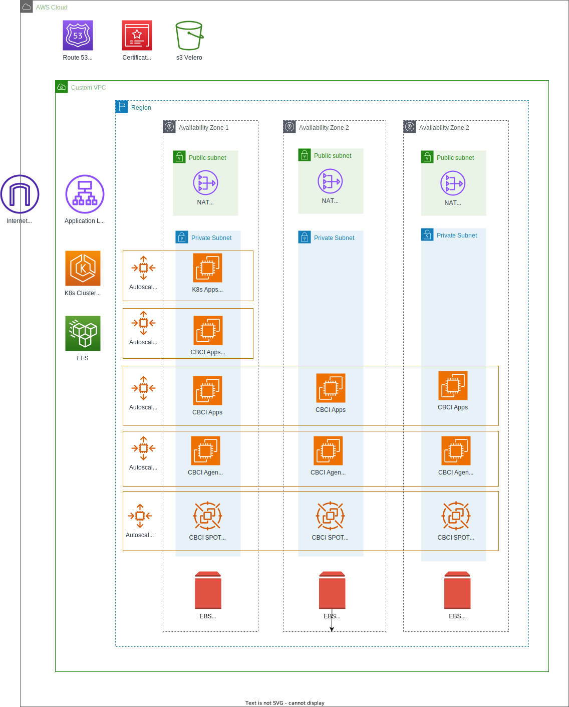

# CloudBees CI Add-on at scale Blueprint

Once you have familiarized yourself with the [Getting Started blueprint](../01-getting-started/README.md), this blueprint presents a more scalable architecture by adding the following **optional EKS Addons**:

- [Cluster Autoscaler](https://aws-ia.github.io/terraform-aws-eks-blueprints-addons/main/addons/cluster-autoscaler/)
- [Node Termination Handler](https://aws-ia.github.io/terraform-aws-eks-blueprints-addons/main/addons/aws-node-termination-handler/)
- [EFS CSI Driver](https://aws-ia.github.io/terraform-aws-eks-blueprints-addons/main/addons/aws-efs-csi-driver/). It can be used by non-HA/HS (optional) and it is required by HA/HS CBCI Controllers.
- [Metrics Server](https://aws-ia.github.io/terraform-aws-eks-blueprints-addons/main/addons/metrics-server/). It is required by CBCI HA/HS Controllers for Horizontal Pod Autoscaling.
- [Velero](https://aws-ia.github.io/terraform-aws-eks-blueprints-addons/main/addons/velero/). It is used for Backup and Restore K8s resources within the CloudBees CI namespace (see [CloudBees docs](https://docs.cloudbees.com/docs/cloudbees-ci/latest/backup-restore/velero-dr)). About PVC backup, it is only used for Block Storage (EBS). EFS uses [AWS Backup](https://aws.amazon.com/backup/).
- [Kube Prometheus Stack](https://aws-ia.github.io/terraform-aws-eks-blueprints-addons/main/addons/kube-prometheus-stack/) for observability of EKS cluster and CloudBees CI Add-on.

> [!IMPORTANT]
> [Autoscaling Groups](https://docs.aws.amazon.com/autoscaling/ec2/userguide/auto-scaling-groups.html) design follows the AWS article [Creating Kubernetes Auto Scaling Groups for Multiple Availability Zones](https://aws.amazon.com/blogs/containers/amazon-eks-cluster-multi-zone-auto-scaling-groups/), creating one ASG per AZ for EBS volumne and one single ASG per Multiple AZ for EFS volumes.

Additionally, it uses [CloudBees Configuration as Code](https://docs.cloudbees.com/docs/cloudbees-ci/latest/casc-oc/casc-intro) for configuring the [Operation Center](https://docs.cloudbees.com/docs/cloudbees-ci/latest/casc-oc/) and [Controllers](https://docs.cloudbees.com/docs/cloudbees-ci/latest/casc-controller/) enabling [New Features for Streamlined DevOps](https://www.cloudbees.com/blog/cloudbees-ci-exciting-new-features-for-streamlined-devops) and [CloudBees CI Hibernation](https://docs.cloudbees.com/docs/cloudbees-ci/latest/cloud-admin-guide/managing-controllers#_hibernation_in_managed_masters) for saving Cloud Billing costs.

> [!NOTE]
> One of the references for the design of this blueprint comes from the [AWS EKS Statefulset pattern](https://github.com/aws-ia/terraform-aws-eks-blueprints/tree/v5.0.0/examples/stateful)

## Architecture

## Prerequisites

Refer to the [Getting Started Blueprint - Prerequisites](../01-getting-started/README.md#prerequisites) section.

## Terraform Docs

<!-- BEGIN_TF_DOCS -->
### Inputs

| Name | Description | Type | Default | Required |
|------|-------------|------|---------|:--------:|
| domain_name | Desired domain name (e.g. example.com) used as suffix for CloudBees CI subdomains (e.g. cjoc.example.com). It requires to be mapped within an existing Route 53 Hosted Zone. | `string` | n/a | yes |
| temp_license | Temporary license details. | `map(string)` | n/a | yes |
| suffix | Unique suffix to be assigned to all resources | `string` | `""` | no |
| tags | Tags to apply to resources. | `map(string)` | `{}` | no |

### Outputs

| Name | Description |
|------|-------------|
| acm_certificate_arn | ACM certificate ARN |
| add_kubeconfig | Add Kubeconfig to local configuration to access the K8s API. |
| cbci_helm | Helm configuration for CloudBees CI Add-on. It is accesible only via state files. |
| cbci_initial_admin_password | Operation Center Service Initial Admin Password for CloudBees CI Add-on. Additionally, there are developer and guest users using the same password. |
| cbci_liveness_probe_ext | Operation Center Service External Liveness Probe for CloudBees CI Add-on. |
| cbci_liveness_probe_int | Operation Center Service Internal Liveness Probe for CloudBees CI Add-on. |
| cbci_namespace | Namespace for CloudBees CI Add-on. |
| cbci_oc_ing | Operation Center Ingress for CloudBees CI Add-on. |
| cbci_oc_pod | Operation Center Pod for CloudBees CI Add-on. |
| cjoc_url | URL of the CloudBees CI Operations Center for CloudBees CI Add-on. |
| eks_cluster_arn | EKS cluster ARN |
| export_kubeconfig | Export KUBECONFIG environment variable to access the K8s API. |
| s3_velero_arn | Velero s3 Bucket Arn |
| velero_backup_team_a | Force to create a velero backup from schedulle for Team A. It can be applicable for rest of schedulle backups. |
| velero_restore_team_a | Restore Team A from backup. It can be applicable for rest of schedulle backups. |
| vpc_arn | VPC ID |
<!-- END_TF_DOCS -->

## Deploy

Refer to the [Getting Started Blueprint - Prerequisites](../01-getting-started/README.md#deploy) section.

Additionally, customize your secrets file by copying `secrets-values.yml.example` to `secrets-values.yml`.

## Validate

Refer to the [Getting Started Blueprint - Prerequisites](../01-getting-started/README.md#validate) section.

## Destroy

Refer to the [Getting Started Blueprint - Prerequisites](../01-getting-started/README.md#destroy) section.
