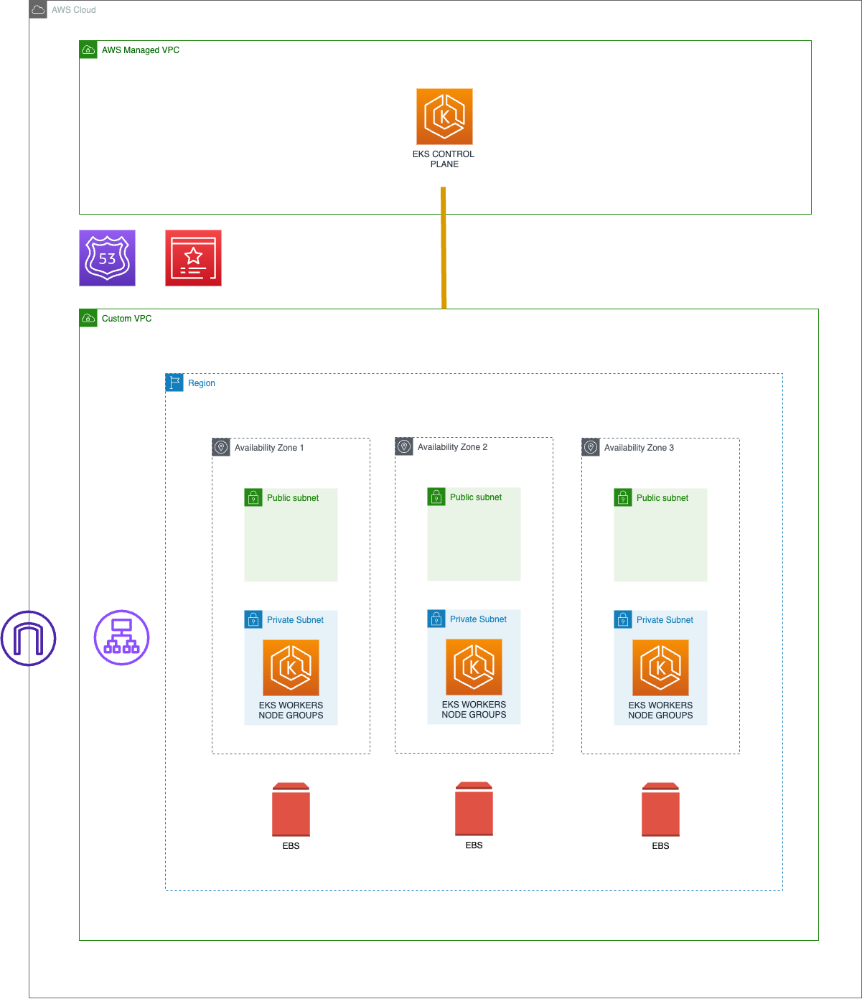

# CloudBees CI Add-on getting started Blueprint

> Get started with CloudBees CI add-on by reviewing this example which deploys the minimum set of resources to install
[CloudBees CI on EKS](https://docs.cloudbees.com/docs/cloudbees-ci/latest/eks-install-guide/) following its [prerequisites](https://docs.cloudbees.com/docs/cloudbees-ci/latest/eks-install-guide/installing-eks-using-helm#_prerequisites):

- AWS Certificate Manager
- [AWS Load Balancer Controller](https://aws-ia.github.io/terraform-aws-eks-blueprints-addons/main/addons/aws-load-balancer-controller/)
- [External DNS](https://aws-ia.github.io/terraform-aws-eks-blueprints-addons/main/addons/external-dns/)

## Overview

The code in this directory showcases an easy way to get started with the CloudBees CI Add-on for AWS EKS and demonstrates its compatibility with [AWS EKS Blueprint v4](https://github.com/aws-ia/terraform-aws-eks-blueprints/tree/v4.32.1) and [AWS EKS Blueprint v5](https://github.com/aws-ia/terraform-aws-eks-blueprints/tree/v5.0.0) (Additional info at [v4 to v5 migration guide](https://aws-ia.github.io/terraform-aws-eks-blueprints/v4-to-v5/motivation/)).

This parent directory contains the common AWS resources extended by every of the `getting-started` blueprint versions:

- [v4](v4/README.md)
- [v5](v5/README.md)

## Prerequisites

### Tools

Ensure that you have the following tools installed locally:

1. [aws cli](https://docs.aws.amazon.com/cli/latest/userguide/install-cliv2.html)
2. [kubectl](https://Kubernetes.io/docs/tasks/tools/)
3. [terraform](https://learn.hashicorp.com/tutorials/terraform/install-cli)

### AWS Authentication

Make sure to export your required [AWS Environment Variables](https://docs.aws.amazon.com/cli/latest/userguide/cli-configure-envvars.html) to your CLI before getting started. For

  ```bash
  export AWS_ACCESS_KEY_ID=... 
  export AWS_SECRET_ACCESS_KEY=...
  export AWS_SESSION_TOKEN=...
  ```

Alternatively

  ```bash
  export AWS_PROFILE=... 
  ```

## Deploy

Initialize the root module and any associated configuration for providers, review the resources that will be created and finally create the resources and deploy CloudBees CI to an EKS Cluster. For more detailed information, see the documentation for the [Terraform Core workflow](https://www.terraform.io/intro/core-workflow).

From the root of the project, run the following command:

```bash
ROOT=getting-started/v4 make tfRun
```

OR

```bash
ROOT=getting-started/v5 make tfRun
```

## Validate

Once the resources have been created, start by importing the credentials to the `$home/.kube/config` by running in your terminal the outcome of the following command:

  ```sh
  eval $(terraform output --raw configure_kubectl)
  ```

Once you get access to K8s API from your terminal, validate that:

- The CloudBees Operation Center Pod is running

  ```sh
  until kubectl get pod -n cloudbees-ci cjoc-0; do sleep 2 && echo "Waiting for Pod to get ready"; done; echo "OC Pod is Ready"
  ```

- The Ingress Controller is ready and has assigned an `ADDRESS`

  ```sh
  until kubectl get ing -n cloudbees-ci cjoc; do sleep 2 && echo "Waiting for Ingress to get ready"; done; echo "Ingress Ready"
  ```

- It is possible to access the CloudBees CI installation Wizard by copying the outcome of the below command in your browser:

  ```sh
  terraform output cjoc_url
  ```

Then, the CloudBees CI installation Wizard will be displayed asking for the initial password that can obtained by:

  ```sh
  kubectl exec -n cloudbees-ci -ti cjoc-0 -- cat /var/jenkins_home/secrets/initialAdminPassword
 ```

Finally, install the suggested plugins and create the first admin user.

## Destroy

From the root of the project, run the following command:

```bash
ROOT=getting-started/v4 make tfDestroy
```

OR

```bash
ROOT=getting-started/v5 make tfDestroy
```

## Architecture


